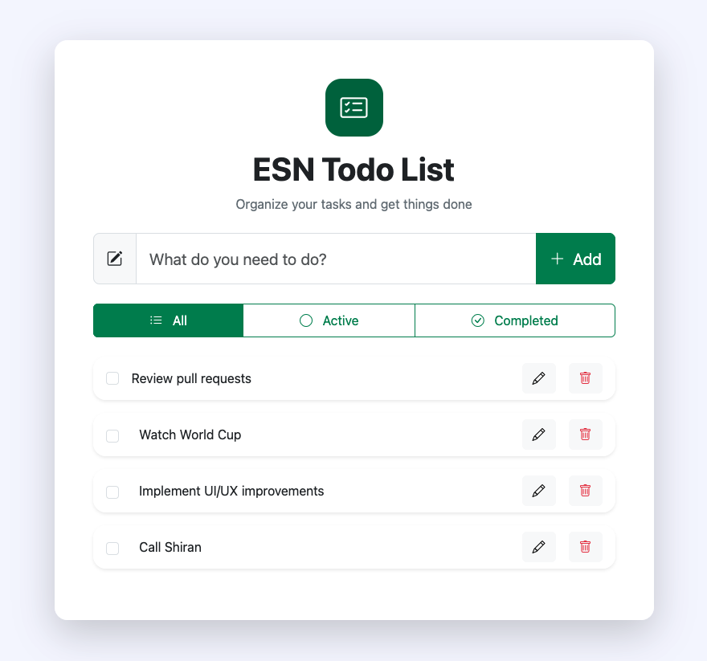

# ESN Todo List



A simple Todo List application built as part of the ESN technical assignment using Laravel, MySQL, Bootstrap and jQuery

## Features

- Create tasks using AJAX
- Edit tasks using AJAX
- Delete tasks using AJAX
- Toggle task status using AJAX
- Filter tasks (All / Active / Completed)
- Responsive Bootstrap UI

## Technologies

- PHP 8.x
- Laravel 13
- MySQL
- Bootstrap 5
- jQuery
- AJAX

## Installation

```bash
git clone https://github.com/oriaoo/esn-todo.git

cd esn-todo

composer install

cp .env.example .env

php artisan key:generate
```

Configure your MySQL database credentials inside the `.env` file.

```bash
php artisan migrate

php artisan serve
```

## Project Structure

app/
└── Http/
└── Controllers/
└── TaskController.php

resources/
├── views/
└── js/

public/
├── css/
└── js/

routes/
└── web.php

## Note

Task filtering is implemented on the client side using jQuery because all tasks are already loaded into the DOM, making additional server requests unnecessary

## Author

Developed by **Oria Malul**
